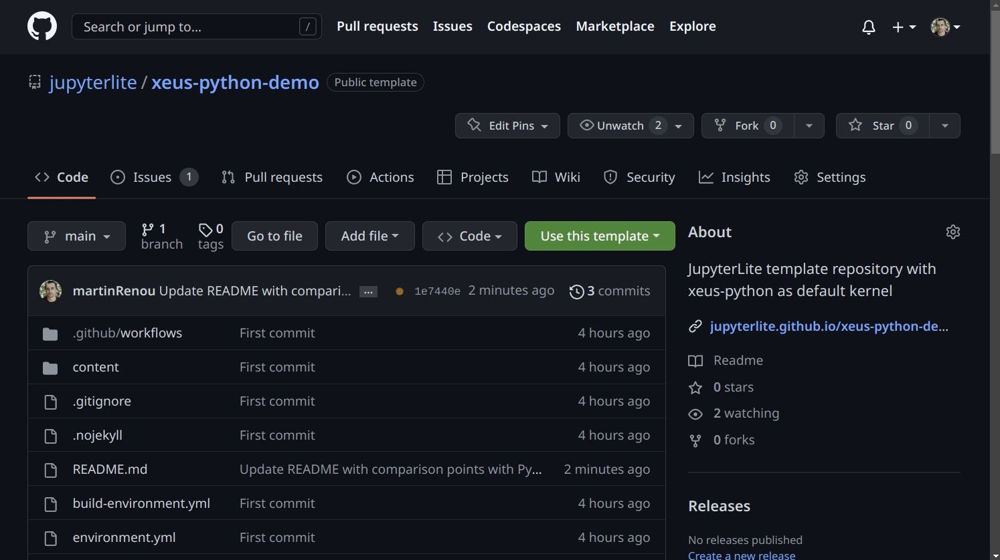

# Create your JupyterLite website

This tutorial will walk you through the steps to create a JupyterLite website locally with the `jupyter-lite` CLI.


## What we will be building

We will be building a JupyterLite website so that users can interact with a Jupyter notebook without having to install anything locally.

The notebook will allow for plotting photos and pictures on a map displayed with `folium`.

Here is a preview of the final result:

```{video} https://user-images.githubusercontent.com/591645/232456713-e8dc2396-d050-4840-9756-051e9c1f3ead.mp4
:width: 800
```

## Deploy on GitHub Pages

If you would like to deploy your JupyterLite website on GitHub Pages, you can follow the following quickstart guide:

https://jupyterlite.readthedocs.io/en/latest/quickstart/deploy.html

This is likely the easiest to get a JupyterLite up and running in just a couple of minutes, without setting up a development environment.




```{note}
**Working via the GitHub UI directly**

If you encounter any issue with the following steps, you can also use the GitHub UI directly to create a new repository and work from there.

You can start from the template repository: https://github.com/jupyterlite/xeus-python-demo

Follow the previous section to get started. Then you can use the GitHub UI to edit the files and commit the changes.
```

## Using the `jupyter-lite` CLI


```{note}
Refer to the documentation for more details: https://jupyterlite.readthedocs.io/en/latest/quickstart/standalone.html
```

### Create a new virtual environment

We recommend using mamba to create a new virtual environment:

If you don't have mamba installed, you can install it with for MacOS and Linux:

```bash
curl micro.mamba.pm/install.sh | bash
```

Or check the documentation for more details: https://mamba.readthedocs.io/en/latest/installation.html#micromamba

```bash
mamba create -n jupyterlite-tutorial -c conda-forge python=3.11 -y
mamba activate
```

For the rest of the tutorial, make sure you are in the `jupyterlite-tutorial` environment.

````{note}
As an alternative you can also use the `venv` module from the standard library:

```bash
python -m venv jupyterlite-tutorial
source jupyterlite-tutorial/bin/activate
```
````

### Install the JupyterLite CLI

Install the JupyterLite CLI with:

```bash
# the jupyterlab_server dependency will be needed later
mamba install -c conda-forge jupyterlite-core jupyterlab_server
```

You can also use `pip`:

```bash
pip install "jupyterlite-core[lab]"
```

The `[lab]` extra (or the `jupyterlab_server` dependency) installs additional dependencies for content and localization.

### Get an empty JupyterLite website

Create an empty JupyterLite website with:

```bash
jupyter lite init
```

By default, this will create a new folder `_output` with the minimal content of the JupyterLite website. You can check the content of the folder with the following command:

```bash
ls _output
```

This should give something like the following:

```bash
bootstrap.js      index.html                  manifest.webmanifest
build             jupyter-lite.ipynb          package.json
config-utils.js   jupyter-lite.json           repl
doc               jupyterlite.schema.v0.json  retro
icon-120x120.png  kernelspecs                 service-worker-b2fb40a.js
icon-512x512.png  lab                         tree
```

### Serve the website locally

You can serve the website locally with:

```bash
jupyter lite serve
```

```{warning}
By default `jupyterlite-core` does not include any kernel.
We will see how to add one in the next section.
```

As an alternative you can also start a Python server with:

```bash
python -m http.server 8000 --directory _output
```

Then open the following URL in your browser: http://localhost:8000

You will be redirected to the JupyterLab interface by default, which should look like the following:


If you would like to access the Notebook interface, you can use the following URL: http://localhost:8000/tree

### Add a kernel

To add a Python kernel to your JupyterLite website, you can install the `jupyterlite-xeus-python` package:

```bash
pip install jupyterlite-xeus-python
```

Then rebuild the website with:

```bash
jupyter lite build
```

It should now be possible to run a Python notebook in your JupyterLite website.

```{note}
Refer to the documentation for more details: https://jupyterlite.readthedocs.io/en/latest/howto/configure/kernels.html
```

### Adding content

Then let's create a new folder to store the notebooks:

```bash
mkdir notebooks
```

Create a new notebook in the `notebooks` folder, and add other files you would like to include in your website.

```{note}
As an example you could use this notebook: https://github.com/norvig/pytudes/blob/main/ipynb/Sudoku.ipynb
```

Then rebuild the website with:

```bash
jupyter lite build --content notebooks
```

```{note}
Refer to the documentation for more details: https://jupyterlite.readthedocs.io/en/latest/howto/index.html#contents
```

### Adding extensions

You can also add JupyterLab extensions to your JupyterLite website.

For example, you can install the `jupyterlab-execute-time` extension with:

```bash
pip install jupyterlab-execute-time
```

Or even a custom theme:

```bash
pip install jupyterlab-night
```

Then rebuild the website with:

```bash
jupyter lite build --contents notebooks
```

```{note}
Refer to the documentation for more details: https://jupyterlite.readthedocs.io/en/latest/howto/configure/simple_extensions.html
```

### Localization and display languages

It's also possible to localize the JupyterLite website so it's available in different languages.

For example, you can install the `jupyterlab-language-pack-fr-FR` package with:

```bash
pip install jupyterlab-language-pack-fr-FR
```

Then rebuild the website with:

```bash
jupyter lite build --contents notebooks
```

### Installing extra Python packages

```{note}
As a reminder we have been using the `jupyterlite-xeus-python` package to add a Python kernel to our JupyterLite website.
This section is for installing extra Python packages for that particular kernel.
We will see below how to install extra Python packages for the Pyodide kernel.
```

Open the `environment.yml` file and add the extra Python packages you would like to install.

For example let's add `folium` and `ipywidgets`:

```yaml
name: jupyterlite-tutorial-demo
channels:
- https://repo.mamba.pm/conda-forge
- https://repo.mamba.pm/emscripten-forge
dependencies:
- ipywidgets=8
- folium
```

The Xeus Python kernel automatically installs the packages from the `environment.yml` file when the website is built.

Then rebuild the website with:

```bash
jupyter lite build --contents notebooks
```

The new packages should now be available in the Python kernel at startup. You can check it is the case by running the following cell:

```python
import folium
print(folium.__version__)
import ipywidgets
print(ipywidgets.__version__)
```


```{warning}
At the time of writing, the `jupyterlite-xeus-python` package does not support installing extra Python packages
from PyPI using the `pip` section in `environment.yml`.
So the packages have to be available on conda-forge or emscripten-forge.
There is however a work-in-progress PR to add this feature.
```

```{note}
**What is Emscripten Forge?**

As the name suggests it is based on the Emscripten toolchain: https://emscripten.org.

> Compile C and C++ code, or any other language that uses LLVM, into WebAssembly, and run it on the Web, Node.js, or other wasm runtimes.

The goal of the Emscripten Forge project is to enable the **composability of computing environments** allowed by package managers and to adopt the conda-forge model for large-scale software distribution crowdsourcing.

Many packages have already been packaged for Emscripten Forge, thanks to the work on the Pyodide (many recipes are the same).


The long term will be to contributing this work to the conda-forge project, so that all recipes live in the same space.

Please have the look at the blog post for more information: https://blog.jupyter.org/mamba-meets-jupyterlite-88ef49ac4dc8
```

```{note}
If you use a package not available on the two channels mentioned above, please open an issue on the Emscripten Forge repository:
https://github.com/emscripten-forge/recipes

You can search for a specific packages using the following links:

- https://prefix.dev/channels/conda-forge
- https://beta.mamba.pm/channels/emscripten-forge?tab=packages
```

```{note}
Refer to the documentation for more details: https://jupyterlite.readthedocs.io/en/latest/howto/xeus-python/preinstalled_packages.html
```

### The `jupyter_lite_config.json` file

The `jupyter_lite_config.json` file contains the configuration to build a JupyterLite website.

This file is picked up automatically when running the `jupyter lite build` command. It is a convenient way to nicely encode the configuration of a JupyterLite website and avoid having to pass a long list of command line arguments.

At the root of the repo, create the `jupyter_lite_config.json` file with the following content:

```json
{
  "LiteBuildConfig": {
    "content": ["notebooks"]
  }
}
```

Then rebuild the website with:

```bash
jupyter lite build
```

The site will still include the contents like before, but we didn't have to pass the `--content notebooks` argument.

### The `jupyter_lite.json` file

The `jupyter_lite.json` file contains the *runtime* configuration of a JupyterLite website.

With this file, you can for example configure the name of the app, or which extensions to disable:

```json
{
  "jupyter-lite-schema-version": 0,
  "jupyter-config-data": {
    "appName": "JupyterLite Tutorial"
  }
}
```

Then rebuild the website with:

```bash
jupyter lite build
```

You should be able to see the new name in the Help menu:


```{note}
Refer to the documentation for more details: https://jupyterlite.readthedocs.io/en/latest/reference/schema-v0.html
```

## Voici: from Jupyter notebooks to static web applications


### What is Voila?

Voila is a Python package that can convert Jupyter notebooks into standalone web applications.

Link to the repository: https://github.com/voila-dashboards/voila

### Installing Voici

```{warning}
🚧 Voici is still very new and subject to changes!
```

Install Voici with `pip`:

```bash
pip install voici
```

Then use the `voici` command to create a static website. In this case we also include the other JupyterLab and Notebook interfaces so they are still available:

```bash
voici build --apps jupyterlab --apps retro
```

And then rebuild the website simply with:

```bash
voici build
```

You can also specify the apps you want to include in the `jupyter_lite_config.json` file:

```json
{
  "LiteBuildConfig": {
    "content": ["notebooks"],
    "apps": ["lab", "retro"]
  }
}
```

Open your browser and navigate to `http://localhost:8000/voici/tree` to see the Voici application.

```{note}
If you encounter an issue, you can try to clear the build cache with:

```bash
rm .jupyterlite.doit.db
```

```{note}
If you are using the GitHub repository template for working on your site, you can update the build command defined in the `.github/workflows/deploy.yml` file:
```

### Templates

You can use different templates for your Voici application.

Templates can modify the layout and the appearance of your Voici application. Here are a few template examples:

- [Voila Material](https://github.com/voila-dashboards/voila-material): Material design template for Voilà
- [Voila GridStack](https://github.com/voila-dashboards/voila-gridstack): Dashboard template for Voilà based on GridStackJS

These templates were originally developed for Voilà, but they can also be used with Voici.

To install a template, you can use the `pip` command:

```bash
pip install voila-material
```

You can also add the template to your dependencies in the `environment.yml` file:

```yaml
dependencies:
  - voila-material
```

Once the template is installed, you can use it by specifying the `--template` option when building your Voici application:

```bash
voici build --template material
```

Here is what a Voici dashboard looks like with the Material template:


### Themes

You can also use different themes for your Voici application.

To use the Dark theme, you can use the `--theme` option when building your Voici application:

```bash
voici build --template material --theme dark
```

You can also use the `?theme` query parameter to choose the theme on the fly while accessing the dashboard. For example:

```text
https://you-voici-deployment.example.com/voici/render/voici.html?theme=dark
```

### Adding Voici options to the `jupyter_lite_config.json` file

You can also provide the Voici options in the `jupyter_lite_config.json` file instead of using the command line:

```json
{
  "LiteBuildConfig": {
    "content": ["notebooks"],
    "apps": ["lab", "retro"]
  },
  "VoilaConfiguration": {
    "theme": "dark",
    "template": "material"
  }
}
```

### Adding our application

Now is time to add our notebook so it can be deployed as a static dashboard with Voici.

Fetch the notebook from the GitHub repository and place it in the `notebooks` folder: https://github.com/jtpio/pyconde-pydata-berlin-2023-jupyterlite-tutorial/blob/main/notebooks/demo.ipynb

Follow the steps mentioned above to build your app.

You can first open JupyterLite in the browser and navigate to the `notebooks` folder to execute the notebook.

Then change the URL to `http://localhost:8000/voici/render/demo.ipynb` to see the Voici dashboard.

```{note}
You can now deploy your Voici application to GitHub Pages or any other static website hosting service 🎉 🥳
```

```{note}
You can see the final result on the tutorial website:
https://jtpio.github.io/pyconde-pydata-berlin-2023-jupyterlite-tutorial/voici/render/demo.html
```

### Additional Configuration

Voici supports additional configuration provided by JupyterLite, such as using custom extensions and settings.

You can refer to the [JupyterLite documentation](https://jupyterlite.readthedocs.io/en/latest/howto/index.html) for more information.

```{warning}
Some configuration options might not supported yet.
Please don't hesitate to open an issue on the [Voici repository](https://github.com/voila-dashboards/voici)
if you would like to use an option not supported by Voici yet.
```

### Deploying a Voici dashboard on GitHub Pages

You can easily deploy Voici to GitHub Pages using the [voici-demo](https://github.com/voila-dashboards/voici-demo) template repository.

The template repository contains a GitHub Action that builds the Voici application and deploys it to GitHub Pages. It also contains an `environment.yml` file where you can specify the packages you need. You can also add Notebooks to the `content` folder.

```{video} https://user-images.githubusercontent.com/591645/222892327-2a5b1341-640d-49c2-9e95-1f2d3ec122be.mp4
:width: 800
```

## Extras

### Using the Pyodide kernel

With the Pyodide kernel you can also install extra Python packages:

https://jupyterlite.readthedocs.io/en/latest/howto/pyodide/packages.html

However at the moment you will also need to install the packages in the notebook so they are available.

First in your virtual environment, install the packages:

```bash
pip install jupyterlite-pyodide-kernel ipywidgets folium
```

```{note}
The `jupyterlite-pyodide-kernel` package installs the Pyodide kernel.
```

Then rebuild JupyterLite with:

```
jupyter lite build
```

Open the browser and navigate to `http://localhost:8000` to see the JupyterLite application.

Finally, in the notebook, install the packages:

```
%pip install -q ipywidgets folium
```

If you create a new cell and run the following code, you should see a map:

```python
import folium
m = folium.Map()
m
```

## Going further

You can have a look at the following resources to learn more about JupyterLite and Voici:

- [JupyterLite documentation](https://jupyterlite.readthedocs.io/en/latest/)
- [Voici documentation](https://voici.readthedocs.io/en/latest/)

Running Python in the browser is made possible by the great of the CPython and Pyodide contributors.
A lot of the Emscripten Forge are based on the work of the Pyodide team. Check out the following resources to learn more:

- [Pyodide documentation](https://pyodide.org/en/stable/)
- [Pyodide GitHub repository](https://github.com/pyodide/pyodide)
- [Emscripten Forge](https://github.com/emscripten-forge/recipes)

You can also check the PyScript project too which is also based on Pyodide: https://pyscript.net/
